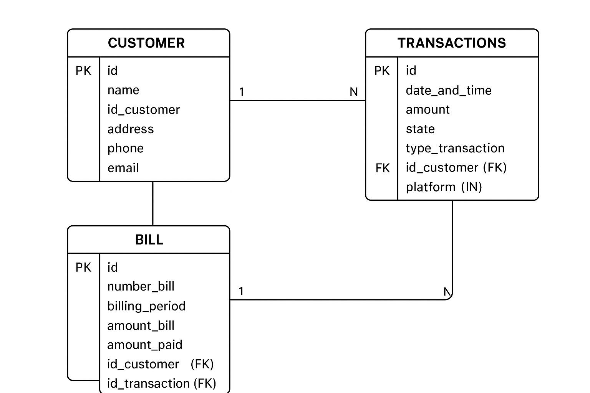

# 📌 Customer Management System

## 📄 Descripción
Este sistema es una **aplicación web de gestión de clientes** conectada a una base de datos **MySQL**.  
Permite:
- Registrar, editar y eliminar clientes.
- Mostrar una tabla con todos los clientes.
- Realizar carga masiva de datos desde un archivo **CSV**.
- Ejecutar consultas avanzadas como el total pagado por cada cliente.

---

## 🚀 Instrucciones para ejecutar el proyecto

### 1️⃣ Backend
1. **Clonar el repositorio**:
   ```bash
   git clone https://github.com/tu_usuario/customer-management.git
   ```
2. **Instalar dependencias**:
   ```bash
   npm install
   ```
3. **Crear la base de datos MySQL**:
   ```sql
   CREATE DATABASE ExpertSoft;
   ```
4. **Importar el script SQL**:
   ```bash
   mysql -u root -p ExpertSoft < database.sql
   ```
5. **Configurar credenciales** en `index.js`:
   ```js
   const db = mysql.createPool({
       host: 'localhost',
       user: 'root',
       password: 'tu_contraseña',
       database: 'ExpertSoft'
   });
   ```
6. **Iniciar el servidor**:
   ```bash
   node index.js
   ```
   El backend quedará disponible en:
   ```
   http://localhost:3000
   ```

---

### 2️⃣ Frontend
1. Abrir el archivo `index.html` en tu navegador.
2. Verificar que en el archivo JavaScript esté configurada la URL correcta:
   ```js
   const API_URL = 'http://localhost:3000';
   ```

---

## 🛠 Tecnologías utilizadas
- **Node.js** + Express (API REST)
- **MySQL** (Base de datos relacional)
- **JavaScript** (Frontend)
- **HTML5 y CSS3** (Interfaz de usuario)
- **Multer** (Subida de archivos)
- **csv-parse** (Procesar CSV)
- **Fetch API** (Comunicación cliente-servidor)

---

## 🗄 Normalización de la base de datos
La base de datos está normalizada hasta la **Tercera Forma Normal (3NF)**:

1. **Primera Forma Normal (1NF)**  
   - Todos los campos son atómicos.  
   - No hay grupos repetitivos.
   
2. **Segunda Forma Normal (2NF)**  
   - Todos los atributos dependen completamente de la clave primaria.
   
3. **Tercera Forma Normal (3NF)**  
   - No existen dependencias transitivas entre atributos no clave.

Esto evita redundancia, mejora el rendimiento y asegura integridad de datos.

---

## 📂 Carga masiva desde CSV
1. Seleccionar un archivo `.csv` con el siguiente formato (separado por `;`):
   ```csv
   name;id_customer;address;phone;email
   Juan Pérez;123456;Calle 10 #5-20;3001234567;juan@example.com
   Ana López;654321;Carrera 15 #8-50;3017654321;ana@example.com
   ```
2. Dar clic en **"Upload CSV"**.
3. El sistema procesará e insertará los registros en la base de datos.

---

## 🔍 Consultas avanzadas

**Consulta: Total pagado por cada cliente**
```sql
SELECT 
    c.id AS customer_id,
    c.name AS customer_name,
    SUM(b.amount_paid) AS total_paid
FROM bill b
JOIN customer c ON b.id_customer = c.id
GROUP BY c.id, c.name;
```
Esta consulta:
- Muestra el total pagado por cada cliente.
- Permite análisis de pagos e ingresos.
- Es útil para reportes financieros.

---

## 🖼 Modelo relacional



---

## 👤 Datos del desarrollador
- **Nombre:** Dawinzon Arley Polo Ciro
- **Clan:** GOSLING
- **Correo:** arleipolo15@gmail.com
